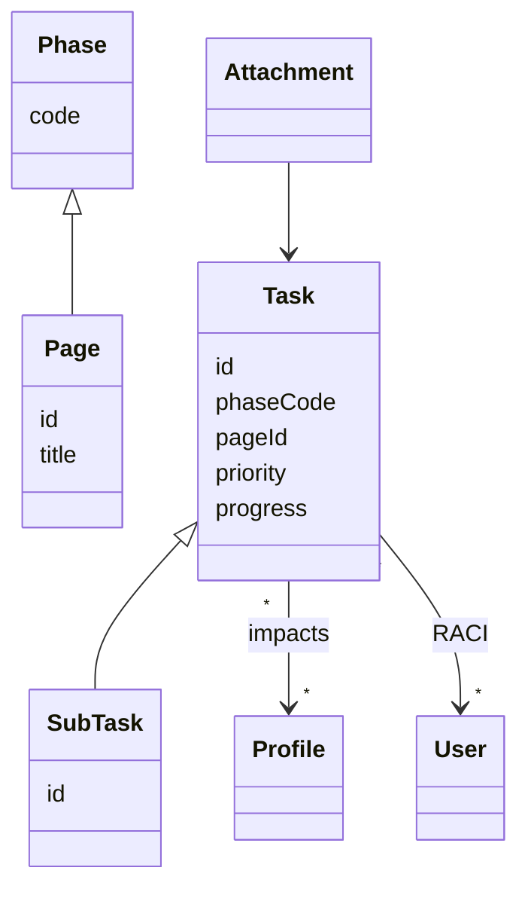

# MEDACAP Project Manager – Architecture de l'API (MVP 7 jours)

> **Version 1.0 – 16 juillet 2025**  |  #style\:REST  #auth\:Session
>
> Document contract‑first construit pour un **architecte Frontend** (React 18 + Vite) : il présente les contrats, flux et conventions indispensables pour consommer l'API Fastify/Socket.io du backend.

---

## 0. Contexte & objectifs

* Couverture **100 % des User Stories *Must*** (US‑01 → US‑18).
* Minimiser la courbe d'apprentissage côté Front (schémas JSON, erreurs prévisibles).
* Faciliter le **mocking** et la **documentation interactive** (OpenAPI 3.1 + Prism).

---

## 1. Principes d'architecture

| Axe                      | Décision clé (MVP)                                           | Raison                                                                                                       |
| ------------------------ | ------------------------------------------------------------ | ------------------------------------------------------------------------------------------------------------ |
| Style API                | **RESTful** (OpenAPI 3.1)                                    | Simple à implémenter dans Fastify, facilement consommé par fetch/axios, compatible mocks Prism & Swagger‑UI. |
| Transport complémentaire | **Socket.io** (WS + fallback polling)                        | < 500 ms live updates, déjà prévu UI (Kanban, liste, locks).                                                 |
| Auth minimaliste         | Cookie **HTTP‑only `sid`** + rôle en session                 | Pas d'e‑mail/mdp ; Front gère juste `POST /sessions` puis stocke cookie.                                     |
| Versioning               | **Pas de prefix** (`/v1/`) au MVP                            | Une seule version interne ; changelog /semver dans git.                                                      |
| Erreurs                  | Format simple `{ error: "message" }`                         | Suffisant MVP ; RFC 7807 backlog.                                                                            |
| Pagination               | **Limit hard** `?limit=50` (offset simple ; cursor backlogé) | Volume attendu faible ; simplifie Back & Front.                                                              |
| Sécurité                 | CORS fermé, `SameSite=strict`, vérif `Origin`                | Protège XSRF ; reverse‑proxy SSL.                                                                            |

---

## 2. Modèle de ressources



*Les identifiants (`id`, `uuid`) suivent les conventions détaillées dans le schéma ER (cf. EdBT v1.2).*

---

## 3. Tableau des endpoints REST

| Méthode | Route                    | Rôle requis (middleware) | Payload requête (extrait)                  | Code(s) réponse | Schéma réponse |
| ------- | ------------------------ | ------------------------ | ------------------------------------------ | --------------- | -------------- |
| POST    | `/sessions`              | —                        | `{ name, role }`                           | 201, 400        | `Session`      |
| DELETE  | `/sessions/:sid`         | Cookie                   | —                                          | 204, 401        | —              |
| GET     | `/phases`                | Public                   | —                                          | 200             | `[Phase]`      |
| GET     | `/pages?phase=M`         | Public                   | —                                          | 200             | `[Page]`       |
| POST    | `/tasks`                 | CP / RF / DEV / STG      | `TaskInput`                                | 201, 400        | `Task`         |
| PATCH   | `/tasks/:id`             | Owner+ / CP / RF         | Champs partiels                            | 200, 403, 404   | `Task`         |
| POST    | `/tasks/:id/subtasks`    | DEV / STG                | `SubTaskInput`                             | 201, 404        | `SubTask`      |
| PATCH   | `/subtasks/:id`          | R/W selon RACI           | `{ done }`                                 | 200, 403, 404   | `SubTask`      |
| POST    | `/tasks/:id/attachments` | R/W                      | `multipart/form-data (maxFileSize: 2 MiB)` | 201, 413        | `Attachment`   |
| GET     | `/export`                | CP / RF                  | Query filtres                              | 200             | `.xlsx` stream |

> **Note :** la liste exhaustive (incl. pages CRUD & seeder) est fournie en annexe **B** (OpenAPI YAML).

---

## 4. Contrats JSON (payloads principaux)

### 4.1 `TaskInput`

```jsonc
{
  "phaseCode": "D",          // char(1)
  "pageId": 7,                // nullable
  "title": "Intégrer endpoint /login",
  "description": "…",        // optional
  "priority": 2,              // 1..5
  "profilesImpacted": ["TEC","MAN"],
  "raci": [{ "userUuid": "…", "letter": "R" }]
}
```

### 4.2 `Task` (réponse sérialisée)

```jsonc
{
  "id": 42,
  "phaseCode": "D",
  "page": { "id": 7, "title": "Sécurité électrique" },
  "title": "Intégrer endpoint /login",
  "description": "…",
  "priority": 2,
  "owner": { "uuid": "…", "displayName": "Alice Martin" },
  "progress": 33.33,
  "profilesImpacted": ["TEC","MAN"],
  "raci": {
    "R": ["…uuid…"],
    "A": [],
    "C": [],
    "I": []
  },
  "createdAt": "2025‑07‑15T10:05:21Z",
  "updatedAt": "2025‑07‑16T08:12:03Z"
}
```

*(Les schémas JSON Schema complets sont référencés dans le bundle OpenAPI.)*

---

## 5. WebSocket / Socket.io

| Event            | Émit par (côté backend) | Payload           | Audience                           |
| ---------------- | ----------------------- | ----------------- | ---------------------------------- |
| `task:new`       | Après `POST /tasks`     | `Task`            | `room project:MEDACAP` (broadcast) |
| `task:update`    | API après PATCH         | `Task`            | room `project:MEDACAP`             |
| `task:delete`    | API après DELETE        | `{ id }`          | room `project:MEDACAP`             |
| `subtask:update` | Après `PATCH /subtasks` | `SubTask`         | même room                          |
| `lock:set`       | Client                  | `{ taskId, user}` | Relay ; broadcast room             |
| `lock:release`   | Client                  | `{ taskId }`      | Relay ; broadcast                  |

### Initialisation côté Front

```ts
import { io } from "socket.io-client";
const socket = io("/", { withCredentials: true }); // cookie sid envoyé
socket.on("task:new", task => addTaskToStore(task));
```

---

## 6. Flow d'authentification minimaliste

1. **Accueil** : POST `/sessions` → cookie `sid` + `Set‑Cookie: HttpOnly; SameSite=Strict`.
2. Le cookie est automatiquement renvoyé sur toutes les requêtes XHR / WS (grâce à `withCredentials`).
3. **Changement de rôle** : POST `/sessions/switch` `{ roleCode, adminPassword }` → nouveau cookie `sid`.
4. Front supprime ses stores locaux au logout (DELETE `/sessions/:sid`).

> Le Front **ne** gère aucune stratégie CSRF supplémentaire (SameSite strict suffisant MVP).

---

## 7. Normalisation des erreurs

```jsonc
// Exemple 403 – interdiction RACI
{
  "error": "Forbidden – user STG cannot modify task 42 (needs R or A)"
}
```

*Codes utilisés* : 400 (syntaxe requête), 422 (validation données), 401 (session manquante/expirée), 403 (rôle insuffisant ou lock), 404 (ressource), 409 (conflit optimiste), 413 (fichier > 2 Mo), 500 (erreur interne).

---

## 8. Sécurité & bonnes pratiques Frontend

* **Utiliser toujours `fetch`/`axios` avec `credentials:"include"`.**
* Vérifier `error.status === 401` → rediriger vers écran d'accueil.
* **Taille pièces jointes** : redimensionner image client‑side (≈ 1920×1080) avant upload.
* Sauvegarder `client_id` (post‑cookie) dans `localStorage` **uniquement** pour afficher message d'erreur, jamais envoyé ; le backend gère la logique lock.

---

## 9. Pagination et filtres

* `/tasks` accepte `?phase=M&ownerUuid=…&q=login`.
* Limite fixe : 50 (retourne header `x-total-count`).
* Pour > 50 lignes, appeler API avec curseur `?offset=50` (backlog nice‑to‑have —— fallback pagination simple pour dev rapide).

---

## 10. Documentation & tooling

| Outil                 | Usage Frontend                                           |
| --------------------- | -------------------------------------------------------- |
| **Swagger‑UI**        | `http://localhost:4000/docs` – exploration manuelle.     |
| **Prism** (Stoplight) | `npm run mock` – serveur stub pendant dev UI offline.    |
| **OpenAPI YAML**      | `api/openapi.yaml` – importable Postman / VS Code REST.  |
| **TS Typings**        | `npm run gen:types` via `openapi-typescript` → models TS |

---

## 11. Scénarios type pour le Frontend

### 11.1 Charge initiale Kanban

1. `await fetch('/phases')` ➜ 7 phases + ordre.
2. `await fetch('/tasks?phase=ALL&limit=1000')` ➜ tasks.
3. Ouvrir WS ; écouter `task:new` et `task:update`.

### 11.2 Création tâche + pièce jointe

```ts
const form = new FormData();
form.append('file', file); // blob < 2 Mo
await api.post('/tasks', taskInput);
await api.post(`/tasks/${taskId}/attachments`, form);
```

WS diffuse `task:new` puis `task:update` (progress %).

---

## 12. Annexes

* **Annexe A :** Glossaire des rôles et phases (référence UI).
* **Annexe B :** Fichier `openapi.yaml` complet (routes, schemas, examples).
* **Annexe C :** Guide intégation Socket.io + Zustand (extraits code).

---

## Annexe A : Glossaire des rôles et phases

### A.1 Rôles projet internes

| Code | Description                  | Permissions                                              |
| ---- | ---------------------------- | -------------------------------------------------------- |
| CP   | Chef de Projet               | Toutes permissions (CRUD pages, export, changement phase) |
| RF   | Responsable Formation        | Création tâches, assignation, export                     |
| DEV  | Développeur                  | Création/édition tâches, sous-tâches                     |
| STG  | Stagiaire                    | Édition sous-tâches assignées                            |
| UF   | Utilisateur Final (testeur)  | Lecture seule + commentaires                             |

### A.2 Phases MEDACAP

| Code | Nom       | Description                                                 |
| ---- | --------- | ----------------------------------------------------------- |
| M    | Mesurer   | Analyse des besoins, métriques                              |
| E    | Exploiter | Exploitation des données collectées                         |
| D    | Définir   | Définition des solutions techniques                         |
| A    | Acquérir  | Acquisition des compétences et ressources                   |
| C    | Certifier | Certification/validation                                    |
| A2   | Appliquer | Mise en œuvre                                               |
| P    | Performer | Optimisation et amélioration continue                       |

### A.3 Profils utilisateurs finaux

| Code | Description                       |
| ---- | --------------------------------- |
| TEC  | Technicien                        |
| MAN  | Manager                           |
| DPS  | Délégué à la Protection des Sites |
| DOP  | Directeur Opérationnel            |
| DF   | Directeur Filiale                 |
| DG   | Directeur Groupe                  |
| RH   | Ressources Humaines               |
| AF   | Administrateur Filiale            |
| SA   | Super Administrateur              |