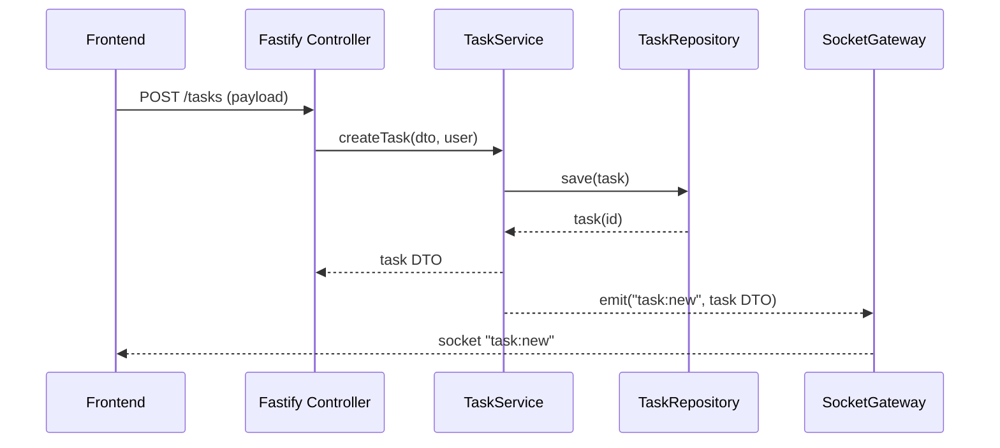

# MEDACAP Project Manager – **Backend Architecture** (MVP 7 jours)

*Version 1.1 – 16 juillet 2025 (incluant verrouillage Nom↔Poste)*

---

## 0. Positionnement dans le workflow

| Étape (flux ArchitecteBackend)                       | Description                                                                                                                                                       |
| ---------------------------------------------------- | ----------------------------------------------------------------------------------------------------------------------------------------------------------------- |
| **Étape 3 / 6 : Architecture applicative & modules** | Nous concevons l'architecture backend détaillée à partir : <br>• *Expression de besoin fonctionnel* v1.1 (15/07/2025) <br>• *EdBT & modèle BDD* v1.0 (15/07/2025) |

> **Livrables précédents intégrés** : Modèle ER + DDL PostgreSQL validés.
> **Livrable courant** : ce document d'architecture + arborescence starter.

---

## 1. Contraintes initiales & décisions clés

| Axe               | Décision (MVP ≤ 7 j)                                                                                     | Justification / Commentaire                                         |
| ----------------- | -------------------------------------------------------------------------------------------------------- | ------------------------------------------------------------------- |
| **Stack**         | **Node.js 20** · **Fastify ≥ 5** · **TypeScript 5** · **Knex ^3** · **PostgreSQL 15** · **Socket.io v5** | Aligné sur EdBT ; Fastify léger, Knex direct (no over‑engineering). |
| **Style**         | Hexagonal + Clean Architecture ✚ SOLID                                                                   | Séparation claire domaine / ports / adapters, testabilité native.   |
| **ORM**           | Pas d'ORM lourd (Prisma) sur MVP                                                                         | Knex + schéma stable suffisent ; gain temps de dev & build.         |
| **CQRS / Event**  | Non appliqué sur MVP                                                                                     | Complexité inutile pour 20 users.                                   |
| **Scalabilité**   | *Single‑pod* API & WS collocated (stickiness Caddy)                                                      | Conforme cible ≤ 100 pico. Redis adapter planifié post‑MVP.         |
| **I18n**          | Français uniquement                                                                                      | RG fonctionnelle.                                                   |
| **Auth**          | Session cookie HTTP‑only, rôle dans payload                                                              | Pas de JWT ni SSO sur MVP.                                          |
| **Observabilité** | Pino JSON + Rotating‑file + health /metrics route                                                        | Loki/Grafana backlogé post‑MVP.                                     |

---

## 2. Vision d'ensemble (C4 – Container level)

```mermaid
graph LR
  A[Browser (React 18)] -- HTTPS / Socket.io --> C(Api Gateway Caddy)
  C --> B(Fastify API + WS)
  B --> D[PostgreSQL 15]
  B -- optional --> E[Redis (lock & pub/sub)]
  C -. static assets .-> A
```

*Tous les conteneurs sont empaquetés Docker ; Compose orchestre `caddy`, `api`, `db` et (optionnel) `redis`.*

---

## 3. Découpage modulaire (Ports / Adapters)

| Couche             | Module                  | Port (interface)                              | Adapter implémenté (MVP)              | Tests auto  |
| ------------------ | ----------------------- | --------------------------------------------- | ------------------------------------- | ----------- |
| **Domaine (core)** | `Task` Aggregate        | `TaskRepository` (CRUD) <br>`ITaskService`    | —                                     | ✅ Jest      |
|                    | `SubTask` Entity        | —                                             | —                                     | ✅           |
|                    | `RaciPolicy`            | `IRaciService`                                | —                                     | ✅           |
| **Application**    | `TaskService`           | utilise ports `TaskRepository`, `SubTaskRepo` | —                                     | ✅           |
| **Ports**          | *DB Port*               | `TaskRepository`                              | Knex adapter                          | ✅ (mock)    |
|                    | *WS Port*               | `IRealtimeBroker` (`emit`, `broadcast`)       | Socket.io adapter                     | Stub        |
|                    | *Storage Port*          | `IAttachmentStore`                            | Local FS `/uploads`                   | Stub        |
| **Adapters HTTP**  | Router (Fastify)        | expose REST selon EdBT                        | `task.routes.ts`, `session.routes.ts` | ✅ Supertest |
| **Adapters WS**    | Socket Gateway          | map domain events → WS events                 | `socket.gateway.ts`                   | ✅ Unit      |
| **Infrastructure** | Knex Migrations / Seeds | —                                             | Scripts `db:migrate`, `seed`          | n/a         |

---

## 4. Arborescence projet **exhaustive** (backend)

```text
backend/
├── .dockerignore
├── .editorconfig
├── .env.sample
├── .eslintrc.cjs
├── .gitignore
├── .prettierrc
├── Dockerfile
├── Makefile
├── README.md
├── docker-compose.yaml
├── jest.config.ts
├── knexfile.ts
├── package.json
├── pnpm-lock.yaml
├── tsconfig.json
├── scripts/
│   ├── migrate.ts
│   └── seed.ts
└── src/
    ├── index.ts                     # bootstrap Fastify + plugins
    ├── server.ts                    # listen, graceful shutdown
    ├── config/
    │   ├── env.ts                   # typed runtime env
    │   └── logger.ts                # pino instance
    ├── core/
    │   ├── domain/
    │   │   ├── task/
    │   │   │   ├── Task.ts
    │   │   │   ├── SubTask.ts
    │   │   │   ├── Raci.ts
    │   │   │   ├── TaskFactory.ts
    │   │   │   └── __tests__/
    │   │   │       └── Task.test.ts
    │   │   ├── page/
    │   │   │   └── Page.ts
    │   │   ├── phase/
    │   │   │   └── Phase.ts
    │   │   ├── profile/
    │   │   │   └── Profile.ts
    │   │   └── shared/
    │   │       ├── ValueObjects.ts
    │   │       └── Result.ts
    │   ├── services/
    │   │   ├── TaskService.ts
    │   │   ├── PageService.ts
    │   │   ├── PhaseService.ts
    │   │   ├── ProfileService.ts
    │   │   └── DeviceUserService.ts
    ├── ports/
    │   ├── db/
    │   │   ├── TaskRepository.ts
    │   │   ├── SubTaskRepository.ts
    │   │   ├── PageRepository.ts
    │   │   ├── PhaseRepository.ts
    │   │   ├── ProfileRepository.ts
    │   │   └── DeviceUserRepository.ts
    │   ├── ws/
    │   │   └── IRealtimeBroker.ts
    │   └── storage/
    │       └── IAttachmentStore.ts
    ├── adapters/
    │   ├── http/
    │   │   ├── controllers/
    │   │   │   ├── TaskController.ts
    │   │   │   ├── PageController.ts
    │   │   │   ├── PhaseController.ts
    │   │   │   ├── ProfileController.ts
    │   │   │   ├── AuthController.ts
    │   │   │   └── ExportController.ts
    │   │   ├── routes/
    │   │   │   ├── task.routes.ts
    │   │   │   ├── page.routes.ts
    │   │   │   ├── phase.routes.ts
    │   │   │   ├── profile.routes.ts
    │   │   │   ├── session.routes.ts
    │   │   │   └── export.routes.ts
    │   │   ├── middlewares/
    │   │   │   └── lockGuard.ts
    │   │   └── schemas/
    │   │       ├── index.ts
    │   │       ├── task.schema.ts
    │   │       ├── subtask.schema.ts
    │   │       ├── page.schema.ts
    │   │       ├── phase.schema.ts
    │   │       ├── profile.schema.ts
    │   │       ├── auth.schema.ts
    │   │       └── export.schema.ts
    │   ├── db/
    │   │   └── knex/
    │   │       ├── index.ts               # knex instance factory
    │   │       ├── BaseKnexRepository.ts
    │   │       ├── TaskKnexRepository.ts
    │   │       ├── SubTaskKnexRepository.ts
    │   │       ├── PageKnexRepository.ts
    │   │       ├── PhaseKnexRepository.ts
    │   │       ├── ProfileKnexRepository.ts
    │   │       ├── migrations/
    │   │       │   ├── 20250715_create_enums.ts
    │   │       │   ├── 20250715_create_tables.ts
    │   │       │   ├── 20250715_add_task_planned_dates.ts
    │   │       │   ├── 20250715_full_text_indexes.ts
    │   │       │   └── 20250716_add_device_user.ts
    │   │       └── seeds/
    │   │           ├── 001_phases.ts
    │   │           ├── 002_profiles.ts
    │   │           ├── 003_users.ts   # 5 entrées : « Chef », « Resp Form », « Dev », « Stagiaire », « UF »
    │   │           ├── 004_pages.ts
    │   │           └── 005_demo_tasks.ts
    │   ├── storage/
    │   │   └── FileSystemAttachmentStore.ts
    │   └── ws/
    │       └── SocketGateway.ts
    ├── infra/
    │   ├── di/
    │   │   └── container.ts             # Awilix registry
    │   └── plugins/
    │       ├── errorHandler.ts
    │       ├── logger.ts (re-export pino)
    │       ├── metrics.ts
    │       └── rateLimit.ts
    ├── types/
    │   └── fastify.d.ts                 # module augmentation
    └── tests/
        ├── unit/
        │   ├── TaskService.test.ts
        │   ├── RaciPolicy.test.ts
        │   ├── PhaseService.test.ts
        │   └── ProfileService.test.ts
        ├── integration/
        │   ├── task.routes.test.ts
        │   ├── page.routes.test.ts
        │   ├── phase.routes.test.ts
        │   ├── profile.routes.test.ts
        │   └── auth.routes.test.ts
        └── e2e/
            └── auth.e2e.ts (flows: create session, switch role via adminPassword)
```

### 4.1 Gestion des entités statiques **Phases** & **Profils impactés**

| Entité                  | Type                                                     | Stockage / Accès                                                                        | Raison d'être dans l'arborescence                                              |
| ----------------------- | -------------------------------------------------------- | --------------------------------------------------------------------------------------- | ------------------------------------------------------------------------------ |
| **Phase**               | Enum `phase_code` + table `phase` (seed `001_phases.ts`) | • Repository + Service pour lecture / ordre <br>• Route `GET /phases` (PhaseController) | Permet d'afficher les 7 colonnes Kanban, sécurise la liste (pas d'édition MVP) |
| **Profile**             | Table `profile` (seed `002_profiles.ts`)                 | • Repository + Service <br>• Route `GET /profiles` (ProfileController)                  | Alimentent filtrage "Profils impactés" et tableau swimlanes                    |
| **Lien Task ↔ Profile** | Table `task_profile`                                     | Géré dans `TaskService` via `ProfileRepository` pour validation des codes               | Expose `profilesImpacted` dans DTO Task                                        |

> Les **Phases** sont **quasi‑constantes** : CRUD désactivé, accès read‑only. <br>
> Les **Profils** peuvent évoluer (AF peut ajouter) : `ProfileService` expose `createProfile()` (protected route à venir post‑MVP).

### 4.2 Description détaillée de la couche HTTP

La couche HTTP complète inclut les composants suivants:

Composant         | Description                                                                              | Fichiers principaux                                                                                                                                                                             |
----------------- | ---------------------------------------------------------------------------------------- | ----------------------------------------------------------------------------------------------------------------------------------------------------------------------------------------------- |
**Contrôleurs**   | Gèrent la logique de traitement des requêtes et coordonnent les appels aux services      | `TaskController.ts`, `PageController.ts`, `PhaseController.ts`, `ProfileController.ts`, `SessionController.ts`, `SubtaskController.ts`, `AttachmentController.ts`, `ExportController.ts`         |
**Routes**        | Définissent les endpoints de l'API et leur association aux contrôleurs                   | `task.routes.ts`, `page.routes.ts`, `phase.routes.ts`, `profile.routes.ts`, `session.routes.ts`, `subtask.routes.ts`, `attachment.routes.ts`, `export.routes.ts`                                |
**Schemas**       | Valident les données entrantes et sortantes avec Zod                                     | `task.schema.ts`, `subtask.schema.ts`, `page.schema.ts`, `phase.schema.ts`, `profile.schema.ts`, `auth.schema.ts`, `export.schema.ts`, `common.schema.ts`                                       |
**Middlewares**   | Interceptent et traitent les requêtes avant qu'elles n'atteignent les contrôleurs        | `authenticate.ts` (vérification session), `authorize.ts` (contrôle des rôles), `lockGuard.ts` (gestion verrous édition)                                                                          |
**Diagnostics**   | Points d'entrée pour monitoring et administration                                        | Routes `/health` et `/metrics` (exposition données Prometheus)                                                                                                                                   |

Cette architecture HTTP respecte les principes REST définis dans le document d'API, tout en maintenant une séparation claire entre les responsabilités.

---

## 5. Flux principaux

### 5.1 Création d'une tâche (+ diffusion temps réel)



### 5.2 Drag & Drop – changement de phase

1. Front envoie `PATCH /tasks/:id` `{ phaseCode: 'D' }`.
2. Service `TaskService.updatePhase` : vérifie droits (owner ou CP/RF), met à jour record.
3. Gateway Socket.io « task\:update » → broadcast room `project:MEDACAP`.

---

## 6. Sécurité & gestion de session

| Aspect        | Implémentation MVP                                                                                                                          |
| ------------- | ------------------------------------------------------------------------------------------------------------------------------------------- |
| *Auth*        | **POST `/sessions`** `{ name, roleCode }` crée une session cookie `sid`.<br>Middleware `sessionGuard` charge `Session` + `User`.            |
| *Role Switch* | **POST `/sessions/switch`** `{ roleCode, adminPassword }` ; vérifie `ADMIN_PASSWORD` puis recrée session.                                   |
| *Logout*      | **DELETE `/sessions/:sid`** détruit la session.                                                                                             |
| *CSRF*        | `SameSite=strict` + header `Origin` check.                                                                                                  |
| *Name lock*   | Cookie `client_id` (HTTP‑only) + middleware **lockGuard** vérifie correspondance `device_user`, rejette 403 et logge `login_name_mismatch`. |
| *Rate‑limit*  | Plugin Fastify `@fastify/rate‑limit` 100 req/min/IP.                                                                                        |

> Plus de routes `POST /login` ou champs `email/password`. L'auth repose **uniquement** sur le *nom* et le *rôle choisi*.

---

## 7. Validation & sérialisation

* Zod schemas définis dans `src/adapters/http/schemas/*.ts`.
* Plugin `fastify-type-provider-zod` pour types TS ↔ runtime.

---

## 8. Observabilité & logs

| Concernes       | Détails MVP                                    |
| --------------- | ---------------------------------------------- |
| **Logger**      | Pino JSON (`level=info`) + pretty en dev.      |
| **Metrics**     | Route `/metrics` Prometheus (fastify‑metrics). |
| **Healthcheck** | `/health` renvoie `200` + timers DB/WS.        |

---

## 9. Tests & qualité

| Niveau      | Outils                    | Seuil couverture |
| ----------- | ------------------------- | ---------------- |
| **Unit**    | Jest + ts‑jest            | ≥ 80 % lines     |
| **Intégr.** | Supertest (HTTP)          | Tâches critiques |
| **E2E**     | Cypress (happy path auth) | Fumée            |
| **Lint**    | Eslint + Prettier         | CI blocant       |

---

## 10. CI/CD (GitHub Actions)

```yaml
name: ci
on: [push]
jobs:
  test:
    runs-on: ubuntu-latest
    services:
      postgres:
        image: postgres:15
        env:
          POSTGRES_DB: medacap_test
          POSTGRES_PASSWORD: pwd
        ports: [5432:5432]
    steps:
      - uses: actions/checkout@v4
      - uses: pnpm/action-setup@v3
        with: {version: "8"}
      - run: pnpm install
      - run: pnpm run db:migrate:test
      - run: pnpm run lint
      - run: pnpm run test:ci
  docker:
    needs: test
    runs-on: ubuntu-latest
    steps:
      - uses: actions/checkout@v4
      - uses: docker/setup-buildx-action@v3
      - run: docker build -t medacap/api:${{ github.sha }} .
      - run: docker push medacap/api:${{ github.sha }}
```

*Déploiement manuel via Portainer (stack `docker-compose`).*

---

## 11. Configuration environnement (.env.sample)

```env
# Server
PORT=4000
ADMIN_PASSWORD=medacap2025!
# DB
DB_URL=postgres://medacap:pwd@db:5432/medacap
# Uploads
UPLOAD_DIR=/app/uploads
# WebSocket
WS_FALLBACK_POLL=10
```

---

## 12. Roadmap post‑MVP

1. **Redis adapter Socket.io** pour scaling multi‑instance.
2. **JWT + SSO** (Keycloak) & multi‑projet.
3. **Import Excel bidirectionnel**.
4. Internationalisation (i18n).
5. Observabilité complète (Loki + Grafana + OpenTelemetry).
6. Feature toggles / Flagsmith pour release incrémentale.

---

## 13. Points ouverts (dépendances API / Front)

| # | Sujet                                     | Besoin clarification          |
| - | ----------------------------------------- | ----------------------------- |
| 1 | Contrôle fin des rôles sur *PATCH /tasks* | Qui peut éditer hors owner ?  |
| 2 | Fichier Excel : pattern nommage           | `export_YYYYMMDD.xlsx` ?      |
| 3 | Limite stockage total `/uploads`          | Quota disque ?                |
| 4 | Stratégie rollback DB + files             | Restores manuels acceptable ? |

---

## 14. Mapping Backend ↔ Vues UI

### 14.1 Kanban MEDACAP (7 colonnes)

* **Endpoint primaire :** `GET /tasks?phase=ALL&limit=1000`
* **Actions :**
  * Drag & drop ⇒ `PATCH /tasks/:id` `{ phaseCode }`
  * Création rapide ⇒ `POST /tasks` (phase par défaut = colonne)
* **Événements WS :** `task:new`, `task:update` (phaseCode), `task:delete`

### 14.2 Liste / Backlog

* **Endpoint :** `GET /tasks` avec filtres `phase,page,owner,q` (full‑text)
* **WebSocket :** mêmes events que Kanban
* **Pagination :** `limit=50` (hard‑limit), param `cursor` envisagé post‑MVP

### 14.3 Tableau par profil impacté

* **Endpoint :** `GET /tasks?profile=TEC` (multi‑valeur possible)
* **Aggregation** côté front : swimlanes = profil, colonnes = phase
* **Note :** param `profile` interroge `task_profile` (JOIN)

### 14.4 Timeline / Gantt simplifié

* **Nouveaux champs** dans `task` (nullable) :
  * `plannedStart` : `date`
  * `plannedEnd` : `date`
* **Endpoint :** `GET /tasks?start=2025-07-01&end=2025-07-31`
* **Actions :** `PATCH /tasks/:id` `{ plannedStart, plannedEnd }` (redimension/drag)
* **Migration** : script `20250715_add_task_planned_dates.ts` (< 30 min)

### 14.5 Calendrier (vue mois/semaine)

* Réutilise `plannedStart` / `plannedEnd`
* **Endpoint :** identique à Timeline, front groupe par jour
* **WS :** `task:update` (dates)

### 14.6 Dashboard métriques *(nice‑to‑have)*

* **Endpoint** : `GET /metrics/overview` (agrégations : COUNT, AVG, burndown)
* **Implémentation** : post‑MVP, basé sur vues SQL materialisées + cache 1 min.

> L'ajout des dates planifiées est **back‑compatible** : les vues Kanban, Backlog et WS ignorent les colonnes NULL. Aucun changement de payload pour les US Must.

---

*Fin du document – prêt pour revue par l'Architecte API*